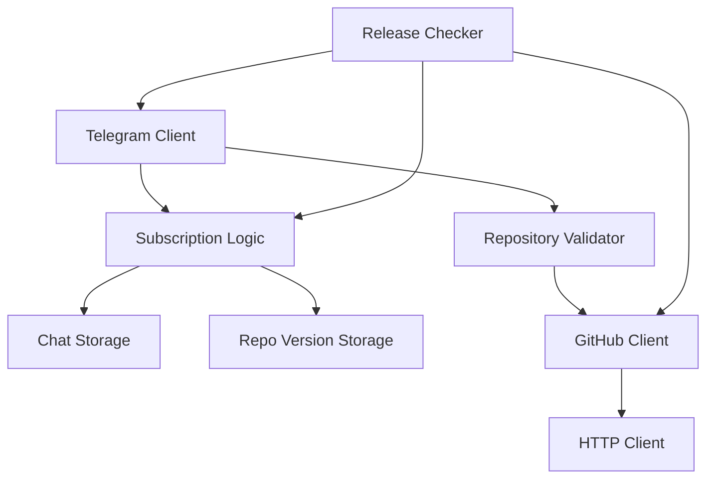
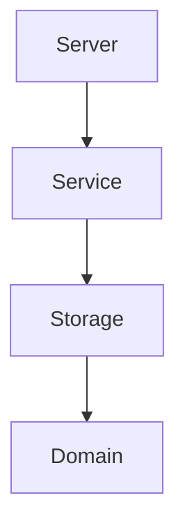

# Release Pager

A Telegram bot is alternative to [GitHub watch function](https://docs.github.com/en/account-and-profile/managing-subscriptions-and-notifications-on-github/managing-subscriptions-for-activity-on-github/viewing-your-subscriptions). It is checking for new releases in your pre-defined list of GitHub repositorues.

## 🧰 Tech Stack
- Scala v.2.13.8
- ZIO v1.0
- Doobie
- HTTP4s
- Circe
- Canoe

## 📋 Tasks

1. [ ] Communicate with users using Telegram
2. [ ] Define user interaction scenarios
3. [ ] Retrieve the latest repository versions from GitHub
4. [ ] Save the latest version of a GitHub repository
5. [ ] Save the user-defined list of GitHub repositories
6. [ ] Retrieve the user-defined list of GitHub repositories
7. [ ] Validate user input
8. [ ] Schedule new version retrieval
9. [ ] Broadcast new version to subscribed users

## 🛎️ Services

Looking at the task list you can see that some functionality can be grouped together and form services.


This is a release pager service diagram. This diagram also visualizes dependencies between services. Here we check that we have divided our services into separate logical pieces. If at this stage you see cyclic dependencies it means you can break the services into smaller entities, or you have grouped unrelated concepts together.

To design the service interface it is common to start with a drafting stage (i.e., in terms of [Tagless Final](https://okmij.org/ftp/tagless-final/index.html) defining the algebras). Dependent services will always call interface methods, so whenever you make change in the implementation of a method of `ServiceA`, it is important that dependent `ServiceB`won't even know about these changes.

This way, if you use pure functions you do not expect any side effects in a method before we run the returned effect. Moreover, we simplify unit testing and improves behavior predictability of your applications.

In short, services should acts as black boxes with clear API.

Now let's check some service interface design tips which might be handy. Types are you friends, do not be lazy and use types:

```scala
// ✅ Good
def distance(velocity: Velocity, time: Time): Distance

// ⛔ Bad
def distance(velocity: BigDecimal, time:BigDecimal): BigDecimal
```

In the second example it is easy to make a mistake and mix up `velocity` and `time` on the caller side.

## 📦 Modules

Before jumping into business logic implementation lets start with structuring the application and specifically with defining SBT modules. Usually, Is good split SBT modules into technical layers. This gives me a simple directed module dependency graph.

For instance, the domain model module will never know about any other modules (eg., storage), but the storage module will depend on the domain model module. As the service module depends on the storage module it will also depend on the domain module transitively.



The structure is very simple:

- **Domain** module contains all the models
- **Storage** module contains all the logic of saving and retrieving the data
- **Service** module contains all the business logic
- **Server** module contains all the logic of starting the server

## 📁 Folder Structure

Separating your business logic into pieces makes maintainability, readability, and navigation through your code easier. Refactoring is not a big deal if you have to replace a small building block in the code.

We already have defined one separation axis - technical layers. These layers are separated from each other using SBT project modules. Let’s define the second separation axis - business logic. This can be done with packages. As we are splitting the application technical layers using SBT modules, It is not recommended creating packages like `/service`, `/repository` etc. Of course, this applies only if it is not a part of your business domain. In this project, packages are used exclusively for business logic modularisation:

```scala
// ✅ Good
// - io.pager.subscription
// - io.pager.lookup

// ⛔ Bad
// - io.pager.service
// - io.pager.repository
```

## 🔆 Reference

- [Designing your first multi-billion startup](https://scala.monster/design-a-pager/) by Pavels Sisojevs